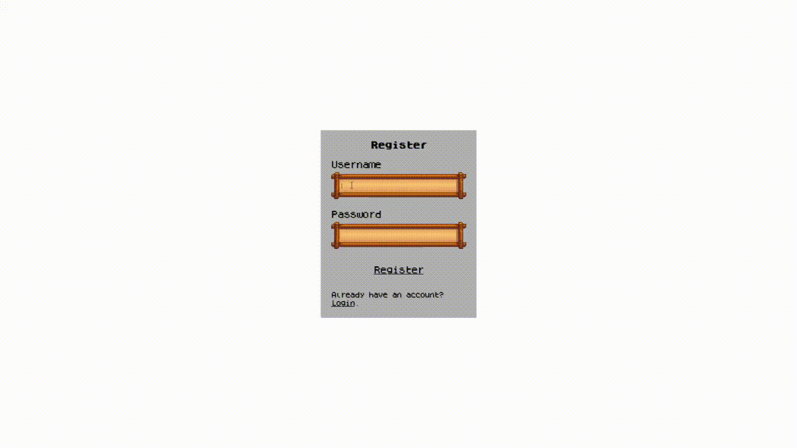
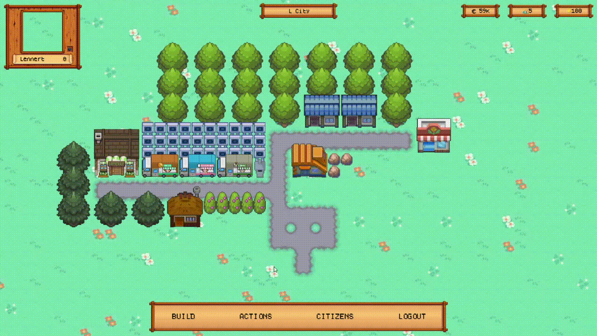
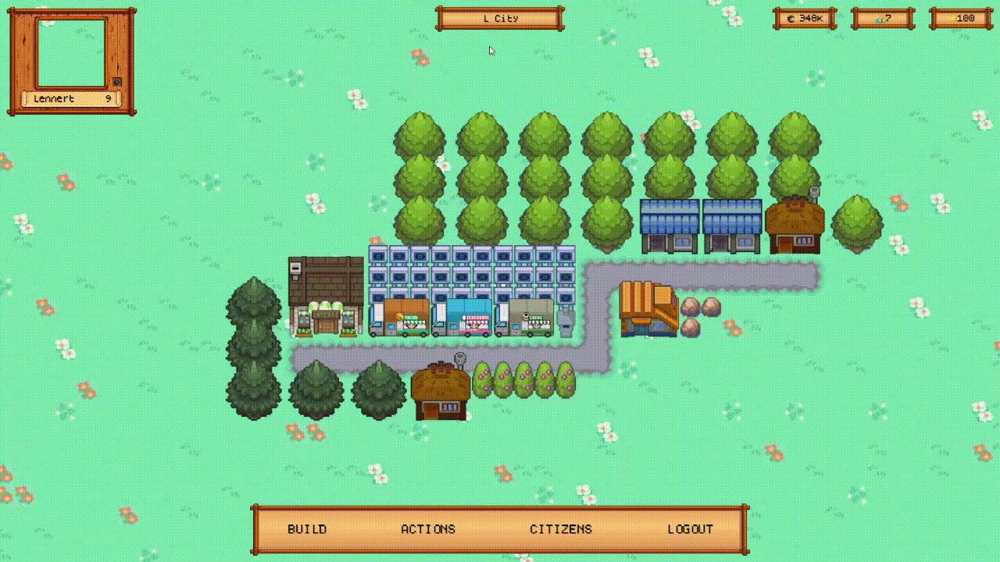
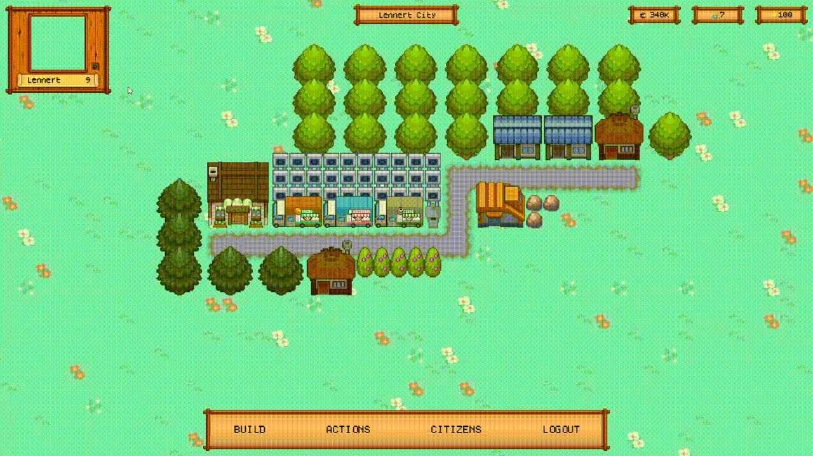
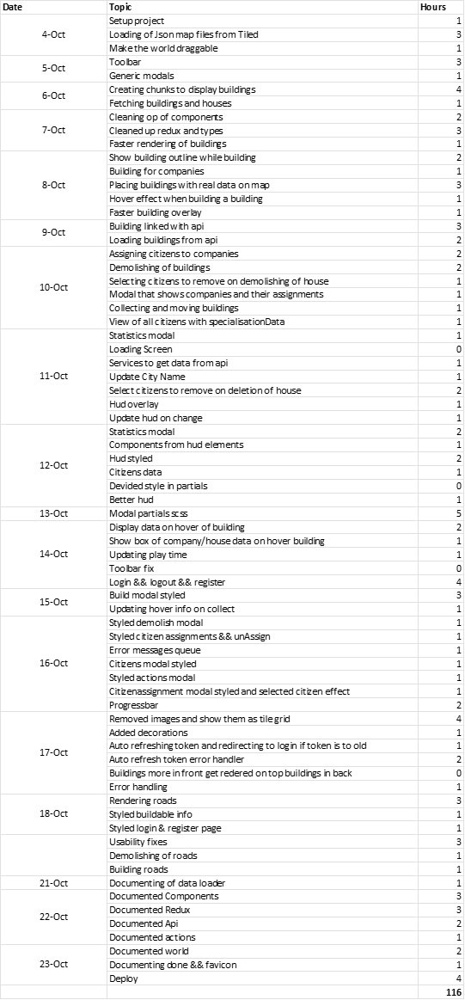

# Pokemon City

Hello and welcome to the project documentation of Pokemon City. A wonderful city builder game, based on the pokemon theme. This is the main browser application in the Pokemon City series.

## What is Pokemon City

Pokemon City is a browser game created in React. The goal of the game is to become the richest city owner, and develop your city as far as possible. It's a creative game because everyone can design his/her city as wanted.

The game will run in every browser, but the best experience will be on chromium based browsers.

## How to play

Its possible to play on the services I host, but you can also play in a private world, but you'll have to fork the Pokemon City repos and host it yourself.

You can play on the public services [here](https://lennertsoffers.be/pokemon-city)

### Register and login

Registering is safe and your password will be protected with care.

Logging in is only necessary once a month (if you don't log out manually)

After a successful registration or login, you will be redirected to your city.

### Building

To build an object, click the 'build' button in the toolbar and the build menu will pop up. Here you can select which building you want to place down. There are 4 main type of objects that can be placed in the city:

#### __Houses__

Houses are objects that have 2 major goals, providing citizens and collecting rent. Each type of house has different properties. The rent that is collected from the houses is dependent on the satisfaction of the city.

Houses generate rent over a certain period of time. When the stored rent is more than 50% of the maximum amount of rent the house can hold, the player can collect the rent. Rent will accumulate through the time but will stop when the max rent is reached.

#### __Companies__

Companies are objects that provide money over time, without a max amount limit. Their profits can be collected, no matter what amount. It is possible to assign a certain amount of citizens to the company as an employee. This will increase the amount of money this company generates. The amount of profit is dependent on multiple factors:

- Amount of citizens living in the city
- Satisfaction of the city
- The statistics of the employees assigned to this company

Companies have on of four types:

- Cooking
- Selling
- Service
- Social

When you assign a citizen to this company, only this stat of the citizen will influence the profit generated by this company. Also, this stat will increase over time for this citizen (since he/she accumulates work experience). The other stats will decrease.

#### __Decorations__

Decorations are objects that improve the satisfaction in your city. Satisfaction influences the speed that money is generated by houses and companies.

Satisfaction explained:

- Negative satisfaction will lower the speed of money generation
- Neutral satisfaction (0) will give you a normal money generation speed
- Positive satisfaction will increment the speed of money generation

The minimum amount of satisfaction is -100, this will result in -50% profit loss. The maximum is +100 which will result in +200% profit increase.

#### __Roads__

Roads are objects that don't influence anything in the city. They are simply used to connect buildings with each other (which is not an obligation). Roads are free.

It is not possible to move roads.

### Moving and demolishing objects

You're able to move and demolish all previous buildings, except roads, they are not movable. Simply click the actions button in the toolbar and select the move or the demolish button.

There is a small catch though. Remember that houses provide citizens to your city. You cannot have more citizens in your city than your houses can provide. Luckily, citizens are not bound to a house, which means you can delete the citizens with the worst stats that are not employed. The game will recognize when you want to demolish a house and lead you through the selecting process of citizens. There is also a button to automatically select the right amount of citizens that have the worst stats for convenience.

### Citizens

We've talked a lot about citizens already, but what are they? As mentioned before, the are spawned by building houses. The citizens themselves are not bound to the houses, but the number of citizens is bound to the number of citizens all your houses can provide together.

When a citizen is spawned by building a house, it gets a random name and random stats.  These stats are values for each type of company. It gets a random max value (max 100) and an effective value for each of these types.

Citizens assigned to a company will increase profit by the stat value corresponding to the type of that company. Also, this value will increase over time, while the other values drop. This increase happens until the effective value reaches the max value of this citizen.

### Collecting money

To collect the rent of a house or the profit of a company. Just hover over it with your mouse and it will show the current savings. A company can always be collected while a house needs to have generated 50% or more of its maximum.

### Changing city name

To change the name of your city. You click in the box with the city name, type another name and click out of it. The name will be saved now.

### Viewing statistics

To view your statistics, you click on your account box in the hud. This will open you personal player information.

A better way to view your statistics (and the statistics of other players) is by downloading the [Pokemon City Stats](https://github.com/lennertsoffers/Pokemon-City-Stats) app

## Planning

1. Brainstorm

    I did a short 10 minute brainstorm and structured the info that I found there. You'll see that in the end, a lot of these ideas would not be implemented.

    The brainstorm can be found [here](./Brainstorm.docx).

2. Deeper analysis

    I created a document and really started to think about all the functionalities of the game. In this document I wrote down the objects of which my game would exist and worked them out in detail.

    The document can be found [here](./Objects.docx).

3. Create API

    Knowing api design is not the scope of this project, it was still a step to be undertaken to create the game. I needed to create a data model, created a safe api with validation and data protection.

4. Setup project

    Before starting to code, I had to setup the react project. I chose to use TypeScript support, since I find it more powerful and bug-safe since it is typed.

    For styling, I chose SCSS as a pre-processor because is such a convenient way to write css without repetition, and holding on to the same graph structure as the DOM.

    Then the folder structure needed to be created. From the beginning, I tried to decouple the api communication from the react components. Therefore I made an 'api' folder containing services that execute the api calls

5. Code the app

    Except that it took a significant amount of time to create this game, I didn't really stumble upon many problems.

    I tried to decouple the different parts of the application as much as possible: redux, api requests, components, routing.

    There were many new things in this app for me, but mainly TypeScript was something I had never used before. In the end, I was really glad that I tried it out, because it would be such a messy codebase without the use of typing.

    Another new topic worth noting was the use of the 'combinedStore' of redux js. This enables you to structure your code per use case in different redux reducers. I'm glad I learned this new redux topic, otherwise my code would have included one massive reducer that is quite hard to understand or modify.

6. Replace mock data with real data

    Now it was time to replace all the mock data for houses, companies and decorations with real balanced data. This enables the progressing system in the game (build something -> save money -> built something better).

    Therefore, I created an excel sheet containing all this data an tweaking it bit by bit.

    You can find the excel sheet [here](./building%20data.xlsx)

7. Deployment

    The deployment went without too many problems. I had to set the correct url as homepage and as baseRoute in the browserRouter of 'react-routing' to make it working. In addition to this, I had to change the code that worked with dates, since my deployment server is located in Belgium and the front ends may use different timezones.

## Time spend

To Track how much time I created an excel sheet tracking my daily progress:

## Overall feeling

I'm really proud with this end result. It was a lot of work, but certainly worth it. My friends think the game is fun and we play it all together😁

The project certainly meets all the requirements, and I hope it even exceeds them a bit. There is always room for improvement of course and some bugfixes, but this is for next year.

That's why I would score my project a 9/10.